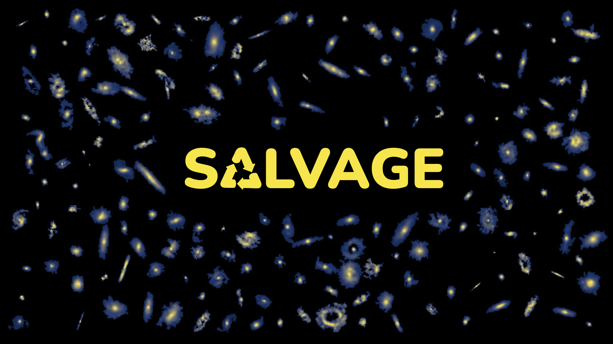

# The SDSS-ALMA Legacy-Value Archival Gas Exploration (SALVAGE) Project Repository #

<!-- PROJECT LOGO -->
 

  
  

<!-- TABLE OF CONTENTS -->

  
Table of Contents

  <ol>
    <li><a href="#introduction">Introductione</a></li>
    <li><a href="#description">Description</a>
    <li><a href="#data-access">Data Accessn</a>
    <li><a href="#acknowledgments">Acknowledgments</a></li>
    <li><a href="#contact">Contact</a></li>
  </ol>

## Introduction ##

SALVAGE is a heterogeneous but complete sampling of galaxies selected from SDSS DR7 with resolved 12CO(1-0) data in the ALMA Science Archive. The total sample is 277 galaxies across a redshift of 0.02-0.25. To image the ALMA visibilities, we use the PHANGS-ALMA reduction pipeline. Our implementation makes no modifications to the imaging pipeline itself, only fine tunes the pipeline to meet our needs using the "key files" that dictate the inputs to the pipeline.  

## Description ##

## Data Access ##

The reduced cubes, moment maps, and higher-order products can be found [here](https://www.canfar.net/storage/vault/list/AstroDataCitationDOI/CISTI.CANFAR/25.0077/data).

## Acknowlegments ##

If you use our data products or code, please cite Wilkinson et al. (2025, submitted to MNRAS).

You may also wish to cite [Leroy et al. (2022)](https://ui.adsabs.harvard.edu/abs/2021ApJS..255...19L/abstract) for relevant use of the PHANGS-ALMA pipeline.

## Contact ##

For questions or feedback, please contact:
Scott Wilkinson (swilkinson-at-uvic.ca)
